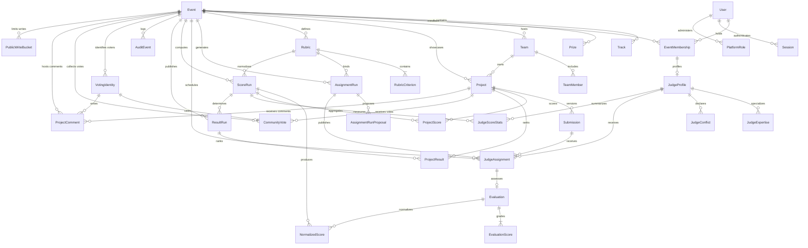

# DogFood Relational Data Model

This document describes the 36-model relational schema and its database invariants, with detail on judging, scoring, results, and T3 community voting.

---

## 1. Entity-Relationship Overview

---

## 2. Platform & Identity Tables

### `User`

Primary user account record.

| Column         | Type             | Constraints / Defaults                        | Description                          |
| :------------- | :--------------- | :-------------------------------------------- | :----------------------------------- |
| `id`           | `UUID`           | `PRIMARY KEY`, `gen_random_uuid()`            | Unique user identifier               |
| `email`        | `VARCHAR(320)`   | `NOT NULL`, `UNIQUE` (case-insensitive index) | Normalized email address             |
| `displayName`  | `TEXT`           | `NOT NULL`                                    | User's public display name           |
| `passwordHash` | `TEXT`           | `NOT NULL`                                    | scrypt password hash                 |
| `status`       | `UserStatus`     | `NOT NULL`, `DEFAULT 'ACTIVE'`                | `ACTIVE`, `SUSPENDED`, `DEACTIVATED` |
| `createdAt`    | `TIMESTAMPTZ(6)` | `NOT NULL`, `DEFAULT CURRENT_TIMESTAMP`       | Account creation timestamp           |
| `updatedAt`    | `TIMESTAMPTZ(6)` | `NOT NULL`                                    | Last update timestamp                |

### `Session`

Server-managed session records.

| Column      | Type             | Constraints / Defaults                         | Description                             |
| :---------- | :--------------- | :--------------------------------------------- | :-------------------------------------- |
| `id`        | `UUID`           | `PRIMARY KEY`, `gen_random_uuid()`             | Unique session identifier               |
| `userId`    | `UUID`           | `NOT NULL`, `FK -> User(id) ON DELETE CASCADE` | Associated user account                 |
| `tokenHash` | `TEXT`           | `NOT NULL`, `UNIQUE`                           | SHA-256 hash of session cookie token    |
| `ipHash`    | `TEXT`           | `NULL`                                         | Hashed client IP address                |
| `userAgent` | `TEXT`           | `NULL`                                         | Client user agent string                |
| `expiresAt` | `TIMESTAMPTZ(6)` | `NOT NULL`                                     | Session expiry time                     |
| `revokedAt` | `TIMESTAMPTZ(6)` | `NULL`                                         | Timestamp of explicit revocation/logout |
| `createdAt` | `TIMESTAMPTZ(6)` | `NOT NULL`, `DEFAULT CURRENT_TIMESTAMP`        | Session start timestamp                 |

### `PlatformRole`

Global platform-level roles (separate from event roles).

| Column      | Type                         | Constraints / Defaults                         | Description                |
| :---------- | :--------------------------- | :--------------------------------------------- | :------------------------- |
| `userId`    | `UUID`                       | `NOT NULL`, `FK -> User(id) ON DELETE CASCADE` | User holding platform role |
| `role`      | `PlatformRoleType`           | `NOT NULL` (`ADMIN`)                           | Global role enum           |
| `createdAt` | `TIMESTAMPTZ(6)`             | `NOT NULL`, `DEFAULT CURRENT_TIMESTAMP`        | Assignment timestamp       |
| **Index**   | `PRIMARY KEY (userId, role)` |                                                | Composite natural key      |

---

## 3. Event & Hackathon Configuration

### `Event`

Hackathon lifecycle, registration window, and publication root.

| Column                 | Type                | Constraints / Defaults                  | Description                              |
| :--------------------- | :------------------ | :-------------------------------------- | :--------------------------------------- |
| `id`                   | `UUID`              | `PRIMARY KEY`, `gen_random_uuid()`      | Event unique identifier                  |
| `name`                 | `TEXT`              | `NOT NULL`                              | Official event title                     |
| `slug`                 | `TEXT`              | `NOT NULL`, `UNIQUE`                    | URL-friendly unique identifier           |
| `shortDescription`     | `TEXT`              | `NULL`                                  | Single-sentence synopsis                 |
| `description`          | `TEXT`              | `NULL`                                  | Full event overview                      |
| `rules`                | `TEXT`              | `NULL`                                  | Competition rules & conduct guidelines   |
| `eligibility`          | `TEXT`              | `NULL`                                  | Eligibility criteria                     |
| `timezone`             | `TEXT`              | `NOT NULL`, `DEFAULT 'UTC'`             | Canonical IANA timezone string           |
| `status`               | `EventStatus`       | `NOT NULL`, `DEFAULT 'DRAFT'`           | `DRAFT`, `PUBLISHED`, `ARCHIVED`         |
| `visibility`           | `EventVisibility`   | `NOT NULL`, `DEFAULT 'PRIVATE'`         | `PUBLIC`, `UNLISTED`, `PRIVATE`          |
| `galleryVisibility`    | `GalleryVisibility` | `NOT NULL`, `DEFAULT 'PRIVATE'`         | `PUBLIC`, `UNLISTED`, `PRIVATE`          |
| `minTeamSize`          | `INTEGER`           | `NOT NULL`, `DEFAULT 1`                 | Minimum members per team                 |
| `maxTeamSize`          | `INTEGER`           | `NOT NULL`, `DEFAULT 4`                 | Maximum members per team                 |
| `registrationOpensAt`  | `TIMESTAMPTZ(6)`    | `NULL`                                  | Start of registration window             |
| `registrationClosesAt` | `TIMESTAMPTZ(6)`    | `NULL`                                  | End of registration window               |
| `submissionOpensAt`    | `TIMESTAMPTZ(6)`    | `NULL`                                  | Start of project submission window       |
| `submissionClosesAt`   | `TIMESTAMPTZ(6)`    | `NULL`                                  | Hard deadline for project submissions    |
| `judgingOpensAt`       | `TIMESTAMPTZ(6)`    | `NULL`                                  | Start of judging window                  |
| `judgingClosesAt`      | `TIMESTAMPTZ(6)`    | `NULL`                                  | Hard deadline for evaluation submissions |
| `resultsAnnouncedAt`   | `TIMESTAMPTZ(6)`    | `NULL`                                  | Public announcement timestamp            |
| `createdById`          | `UUID`              | `NOT NULL`, `FK -> User(id)`            | Event creator                            |
| `createdAt`            | `TIMESTAMPTZ(6)`    | `NOT NULL`, `DEFAULT CURRENT_TIMESTAMP` | Creation timestamp                       |
| `updatedAt`            | `TIMESTAMPTZ(6)`    | `NOT NULL`                              | Last update timestamp                    |

### `EventMembership`

Event-scoped roles and user status.

| Column      | Type                             | Constraints / Defaults                  | Description                                   |
| :---------- | :------------------------------- | :-------------------------------------- | :-------------------------------------------- |
| `id`        | `UUID`                           | `PRIMARY KEY`, `gen_random_uuid()`      | Membership unique identifier                  |
| `eventId`   | `UUID`                           | `NOT NULL`, `FK -> Event(id)`           | Associated event                              |
| `userId`    | `UUID`                           | `NOT NULL`, `FK -> User(id)`            | Enrolled user                                 |
| `role`      | `EventRole`                      | `NOT NULL`                              | `ORGANIZER`, `JUDGE`, `PARTICIPANT`           |
| `status`    | `MembershipStatus`               | `NOT NULL`, `DEFAULT 'ACTIVE'`          | `ACTIVE`, `WITHDRAWN`, `SUSPENDED`, `REVOKED` |
| `metadata`  | `JSONB`                          | `NULL`                                  | Custom registration fields                    |
| `createdAt` | `TIMESTAMPTZ(6)`                 | `NOT NULL`, `DEFAULT CURRENT_TIMESTAMP` | Enrollment timestamp                          |
| `updatedAt` | `TIMESTAMPTZ(6)`                 | `NOT NULL`                              | Last update timestamp                         |
| **Index**   | `UNIQUE (eventId, userId, role)` |                                         | Enforces single role instance per user        |

### `Track` & `Prize`

- `Track`: Scoped competition categories (`id`, `eventId`, `name`, `slug`, `description`, `createdAt`). Unique `(eventId, slug)`.
- `Prize`: Competition awards (`id`, `eventId`, `trackId?`, `name`, `description`, `position`, `amount`, `currency`, `createdAt`).

---

## 4. Projects & Versioned Submissions

### `Project`

Mutable workspace context for a hackathon team project.

| Column          | Type                     | Constraints / Defaults             | Description                       |
| :-------------- | :----------------------- | :--------------------------------- | :-------------------------------- |
| `id`            | `UUID`                   | `PRIMARY KEY`, `gen_random_uuid()` | Project unique identifier         |
| `eventId`       | `UUID`                   | `NOT NULL`, `FK -> Event(id)`      | Associated hackathon event        |
| `teamId`        | `UUID`                   | `NOT NULL`, `FK -> Team(id)`       | Owning team                       |
| `trackId`       | `UUID`                   | `NULL`, `FK -> Track(id)`          | Selected competition track        |
| `name`          | `TEXT`                   | `NOT NULL`                         | Working project title             |
| `slug`          | `TEXT`                   | `NOT NULL`                         | Unique project slug per event     |
| `tagline`       | `TEXT`                   | `NULL`                             | Short pitch                       |
| `description`   | `TEXT`                   | `NULL`                             | Full description                  |
| `repositoryUrl` | `TEXT`                   | `NULL`                             | Source repository link            |
| `demoUrl`       | `TEXT`                   | `NULL`                             | Live demonstration link           |
| `status`        | `ProjectStatus`          | `NOT NULL`, `DEFAULT 'DRAFT'`      | `DRAFT`, `SUBMITTED`, `WITHDRAWN` |
| **Index**       | `UNIQUE (eventId, slug)` |                                    | Slugs unique per event            |

### `Submission`

Immutable versioned snapshot of a project at submission time.

| Column           | Type                          | Constraints / Defaults             | Description                                         |
| :--------------- | :---------------------------- | :--------------------------------- | :-------------------------------------------------- |
| `id`             | `UUID`                        | `PRIMARY KEY`, `gen_random_uuid()` | Submission snapshot UUID                            |
| `projectId`      | `UUID`                        | `NOT NULL`, `FK -> Project(id)`    | Parent project                                      |
| `version`        | `INTEGER`                     | `NOT NULL` (1, 2, 3...)            | Monotonically increasing version number             |
| `title`          | `TEXT`                        | `NOT NULL`                         | Snapshot project title                              |
| `description`    | `TEXT`                        | `NOT NULL`                         | Snapshot description                                |
| `repositoryUrl`  | `TEXT`                        | `NULL`                             | Snapshot repo URL                                   |
| `demoUrl`        | `TEXT`                        | `NULL`                             | Snapshot demo URL                                   |
| `projectName`    | `TEXT`                        | `NULL`                             | Frozen project name at submit time                  |
| `projectTagline` | `TEXT`                        | `NULL`                             | Frozen project tagline                              |
| `trackId`        | `UUID`                        | `NULL`                             | Frozen track UUID                                   |
| `trackName`      | `TEXT`                        | `NULL`                             | Frozen track name                                   |
| `status`         | `SubmissionStatus`            | `NOT NULL`, `DEFAULT 'DRAFT'`      | `DRAFT`, `SUBMITTED`, `LOCKED`, `WITHDRAWN`         |
| `createdById`    | `UUID`                        | `NOT NULL`, `FK -> User(id)`       | Submitting author                                   |
| `submittedAt`    | `TIMESTAMPTZ(6)`              | `NULL`                             | Exact submission timestamp                          |
| `lockedAt`       | `TIMESTAMPTZ(6)`              | `NULL`                             | Timestamp of lock                                   |
| **Index**        | `UNIQUE (projectId, version)` |                                    | Version uniqueness per project                      |
| **Trigger**      | `Submission_guard`            | `BEFORE UPDATE OR DELETE`          | Prevents mutation or deletion once SUBMITTED/LOCKED |

---

## 5. Phase 4A: Judging Setup, Rubrics & Assignments

### `JudgeProfile`

Judge capacity and profile, uniquely linked to an `EventMembership` with role `JUDGE`.

| Column              | Type      | Constraints / Defaults                            | Description                               |
| :------------------ | :-------- | :------------------------------------------------ | :---------------------------------------- |
| `id`                | `UUID`    | `PRIMARY KEY`, `gen_random_uuid()`                | Judge profile unique identifier           |
| `eventMembershipId` | `UUID`    | `NOT NULL`, `UNIQUE`, `FK -> EventMembership(id)` | 1-to-1 link to active JUDGE membership    |
| `bio`               | `TEXT`    | `NULL`                                            | Judge biography / professional background |
| `organization`      | `TEXT`    | `NULL`                                            | Judge employer / affiliated organization  |
| `maxAssignments`    | `INTEGER` | `NULL`                                            | Maximum concurrent assignment capacity    |
| `available`         | `BOOLEAN` | `NOT NULL`, `DEFAULT true`                        | Availability toggle                       |

### `JudgeExpertise` & `JudgeConflict`

- `JudgeExpertise`: Track-specific competence levels 1–5 (`judgeProfileId`, `trackId`, `expertiseLevel`).
- `JudgeConflict`: Declared conflict of interest (`id`, `judgeProfileId`, `teamId?`, `projectId?`, `organization?`, `type`, `reason`).

### `Rubric` & `RubricCriterion`

Versioned scoring criteria bound to an event.

- `Rubric`: (`id`, `eventId`, `name`, `version`, `status` (`DRAFT`, `PUBLISHED`, `ARCHIVED`), `publishedAt`). Unique `(eventId, version)`.
  - _Trigger_: Published rubrics cannot be modified or deleted.
- `RubricCriterion`: (`id`, `rubricId`, `name`, `description`, `weight` (`DECIMAL(10,9)`), `minScore` (`DECIMAL(12,4)`), `maxScore` (`DECIMAL(12,4)`), `displayOrder`).
  - _Trigger_: Criteria cannot change after rubric publication; weights must sum to 1.0 (100%).

### `AssignmentRun` & `AssignmentRunProposal`

Proposal-based algorithmic assignment generator.

- `AssignmentRun`: (`id`, `eventId`, `rubricVersionId`, `type` (`MANUAL`, `BATCH`), `status` (`PREVIEW`, `PUBLISHED`, `SUPERSEDED`), `reviewsPerSubmission`, `algorithm`, `algorithmVersion`, `allocationSource`, `previewStats` (`JSONB`), `publishedAt`).
  - _Unique_: `(id, rubricVersionId)` composite FK target. Partial index enforces only one active `PREVIEW` run per event.
- `AssignmentRunProposal`: Proposed (judge, submission) pairs during `PREVIEW` status. Invisible to judges until published.

### `JudgeAssignment`

Authoritative published evaluation assignments.

| Column             | Type                                    | Constraints / Defaults                  | Description                                          |
| :----------------- | :-------------------------------------- | :-------------------------------------- | :--------------------------------------------------- |
| `id`               | `UUID`                                  | `PRIMARY KEY`, `gen_random_uuid()`      | Assignment UUID                                      |
| `eventId`          | `UUID`                                  | `NOT NULL`, `FK -> Event(id)`           | Event scope                                          |
| `runId`            | `UUID`                                  | `NOT NULL`                              | Parent AssignmentRun                                 |
| `rubricId`         | `UUID`                                  | `NOT NULL`                              | Bound rubric version (composite FK to AssignmentRun) |
| `judgeProfileId`   | `UUID`                                  | `NOT NULL`, `FK -> JudgeProfile(id)`    | Assigned judge                                       |
| `submissionId`     | `UUID`                                  | `NOT NULL`, `FK -> Submission(id)`      | Assigned snapshot                                    |
| `assignmentMethod` | `AssignmentMethod`                      | `NOT NULL`                              | `MANUAL`, `BATCH`                                    |
| `assignedById`     | `UUID`                                  | `NULL`, `FK -> User(id)`                | Assigning organizer                                  |
| `assignedAt`       | `TIMESTAMPTZ(6)`                        | `NOT NULL`, `DEFAULT CURRENT_TIMESTAMP` | Assignment timestamp                                 |
| `status`           | `AssignmentStatus`                      | `NOT NULL`, `DEFAULT 'ASSIGNED'`        | `ASSIGNED`, `COMPLETED`, `REASSIGNED`, `REVOKED`     |
| **Index**          | `UNIQUE (judgeProfileId, submissionId)` |                                         | No duplicate judge assignments per submission        |
| **Index**          | `UNIQUE (id, rubricId)`                 |                                         | Target for Evaluation composite foreign key          |

### `Evaluation` & `EvaluationScore`

Raw evidence submitted by judges.

- `Evaluation`: (`id`, `assignmentId`, `rubricId`, `status` (`NOT_STARTED`, `IN_PROGRESS`, `SUBMITTED`), `comments`, `startedAt`, `submittedAt`, `lockedAt`).
  - Composite FK `(assignmentId, rubricId) -> JudgeAssignment(id, rubricId)` guarantees strict rubric binding.
- `EvaluationScore`: (`id`, `evaluationId`, `criterionId`, `score` (`DECIMAL(12,4)`), `comment`).
  - _Trigger_: `Submitted raw scores are immutable`. Once an Evaluation reaches `SUBMITTED`, raw scores and comments can never be modified or deleted.

---

## 6. Phase 4B: Scoring, Normalization & Results

### `ScoreRun`

Immutable batch scoring and normalization run.

| Column                     | Type                                                                               | Constraints / Defaults                  | Description                                            |
| :------------------------- | :--------------------------------------------------------------------------------- | :-------------------------------------- | :----------------------------------------------------- |
| `id`                       | `UUID`                                                                             | `PRIMARY KEY`, `gen_random_uuid()`      | ScoreRun unique identifier                             |
| `eventId`                  | `UUID`                                                                             | `NOT NULL`, `FK -> Event(id)`           | Scoped hackathon event                                 |
| `status`                   | `ScoreRunStatus`                                                                   | `NOT NULL`, `DEFAULT 'CREATING'`        | `CREATING`, `COMPLETED`, `FAILED`                      |
| `algorithm`                | `TEXT`                                                                             | `NOT NULL`                              | Descriptive algorithm name (`Z_SCORE`)                 |
| `algorithmVersion`         | `TEXT`                                                                             | `NOT NULL`                              | Descriptive version string (`V1`)                      |
| `method`                   | `TEXT`                                                                             | `NOT NULL`, `DEFAULT 'Z_SCORE'`         | Formal normalization method                            |
| `methodVersion`            | `TEXT`                                                                             | `NOT NULL`, `DEFAULT 'V1'`              | Formal normalization version                           |
| `parameters`               | `JSONB`                                                                            | `NOT NULL`                              | Serialized parameter configuration                     |
| `rubricVersionId`          | `UUID`                                                                             | `NULL`, `FK -> Rubric(id)`              | Single published rubric used for the run               |
| `inputEvaluationIds`       | `UUID[]`                                                                           | `NOT NULL`, `DEFAULT '{}'`              | Sorted array of exact evaluation IDs used as evidence  |
| `inputSetHash`             | `TEXT`                                                                             | `NOT NULL`, `DEFAULT ''`                | SHA-256 hash of sorted `inputEvaluationIds`            |
| `coverageDiagnostics`      | `JSONB`                                                                            | `NULL`                                  | Coverage completeness and project shortfall warnings   |
| `normalizationDiagnostics` | `JSONB`                                                                            | `NULL`                                  | Judge-level variance flags and suspended judge notices |
| `createdById`              | `UUID`                                                                             | `NOT NULL`, `FK -> User(id)`            | Organizer who triggered the run                        |
| `completedAt`              | `TIMESTAMPTZ(6)`                                                                   | `NULL`                                  | Completion timestamp                                   |
| `failedAt`                 | `TIMESTAMPTZ(6)`                                                                   | `NULL`                                  | Failure timestamp                                      |
| `failureReason`            | `TEXT`                                                                             | `NULL`                                  | Error details if failed                                |
| `createdAt`                | `TIMESTAMPTZ(6)`                                                                   | `NOT NULL`, `DEFAULT CURRENT_TIMESTAMP` | Run initiation timestamp                               |
| **Index**                  | `UNIQUE (eventId, method, methodVersion, inputSetHash) WHERE status = 'COMPLETED'` |                                         | Idempotent execution guard                             |
| **Trigger**                | `ScoreRun_guard`                                                                   | `BEFORE UPDATE OR DELETE`               | Rejects UPDATE/DELETE once `COMPLETED` or `FAILED`     |

### `JudgeScoreStats`

Relational per-judge normalization provenance and sample parameters for a `ScoreRun`.

| Column             | Type                                  | Constraints / Defaults                  | Description                                                     |
| :----------------- | :------------------------------------ | :-------------------------------------- | :-------------------------------------------------------------- |
| `id`               | `UUID`                                | `PRIMARY KEY`, `gen_random_uuid()`      | Stats record UUID                                               |
| `scoreRunId`       | `UUID`                                | `NOT NULL`, `FK -> ScoreRun(id)`        | Associated ScoreRun                                             |
| `judgeProfileId`   | `UUID`                                | `NOT NULL`, `FK -> JudgeProfile(id)`    | Target judge                                                    |
| `evaluationCount`  | `INTEGER`                             | `NOT NULL`                              | Number of submitted evaluations by judge in this run ($N$)      |
| `mean`             | `NUMERIC(20,8)`                       | `NOT NULL`                              | Population mean of judge's raw weighted scores ($\mu$)          |
| `populationStdDev` | `NUMERIC(20,8)`                       | `NOT NULL`                              | Population standard deviation ($\sigma$, denominator $N$)       |
| `diagnostic`       | `TEXT`                                | `NULL`                                  | Diagnostic flag (e.g. `INSUFFICIENT_VARIATION` if $\sigma = 0$) |
| `createdAt`        | `TIMESTAMPTZ(6)`                      | `NOT NULL`, `DEFAULT CURRENT_TIMESTAMP` | Record creation timestamp                                       |
| **Index**          | `UNIQUE (scoreRunId, judgeProfileId)` |                                         | Exactly one stats record per judge per run                      |
| **Trigger**        | `JudgeScoreStats_guard`               | `BEFORE UPDATE OR DELETE`               | Immutable after creation                                        |

### `NormalizedScore`

Per-evaluation normalized Z-score derived within a `ScoreRun`.

| Column            | Type                                | Constraints / Defaults                  | Description                                                 |
| :---------------- | :---------------------------------- | :-------------------------------------- | :---------------------------------------------------------- |
| `id`              | `UUID`                              | `PRIMARY KEY`, `gen_random_uuid()`      | NormalizedScore unique identifier                           |
| `scoreRunId`      | `UUID`                              | `NOT NULL`, `FK -> ScoreRun(id)`        | Parent ScoreRun                                             |
| `evaluationId`    | `UUID`                              | `NOT NULL`, `FK -> Evaluation(id)`      | Evaluated evidence source                                   |
| `judgeProfileId`  | `UUID`                              | `NULL`, `FK -> JudgeProfile(id)`        | Evaluating judge                                            |
| `submissionId`    | `UUID`                              | `NULL`, `FK -> Submission(id)`          | Evaluated submission snapshot                               |
| `projectId`       | `UUID`                              | `NULL`, `FK -> Project(id)`             | Evaluated project                                           |
| `rawScore`        | `NUMERIC(20,8)`                     | `NOT NULL`                              | Weighted raw score on rubric scale                          |
| `normalizedScore` | `NUMERIC(20,8)`                     | `NOT NULL`                              | Standardized Z-score ($z = \frac{x - \mu}{\sigma}$)         |
| `diagnostic`      | `TEXT`                              | `NULL`                                  | Evaluation-level diagnostic (e.g. `INSUFFICIENT_VARIATION`) |
| `createdAt`       | `TIMESTAMPTZ(6)`                    | `NOT NULL`, `DEFAULT CURRENT_TIMESTAMP` | Record creation timestamp                                   |
| **Index**         | `UNIQUE (scoreRunId, evaluationId)` |                                         | Exactly one normalized score per evaluation per run         |
| **Trigger**       | `NormalizedScore_guard`             | `BEFORE UPDATE OR DELETE`               | Immutable after creation                                    |

### `ProjectScore`

Aggregated project scores and coverage diagnostics within a `ScoreRun`.

| Column             | Type                             | Constraints / Defaults                  | Description                                   |
| :----------------- | :------------------------------- | :-------------------------------------- | :-------------------------------------------- |
| `id`               | `UUID`                           | `PRIMARY KEY`, `gen_random_uuid()`      | ProjectScore unique identifier                |
| `scoreRunId`       | `UUID`                           | `NOT NULL`, `FK -> ScoreRun(id)`        | Parent ScoreRun                               |
| `projectId`        | `UUID`                           | `NOT NULL`, `FK -> Project(id)`         | Scored project                                |
| `aggregatedScore`  | `NUMERIC(20,8)`                  | `NOT NULL`                              | Arithmetic mean of normalized Z-scores        |
| `rawAverage`       | `NUMERIC(20,8)`                  | `NOT NULL`, `DEFAULT 0`                 | Arithmetic mean of raw weighted scores        |
| `evaluationCount`  | `INTEGER`                        | `NOT NULL`                              | Submitted evaluations received by project     |
| `requiredCount`    | `INTEGER`                        | `NOT NULL`, `DEFAULT 0`                 | Required reviews per assignment policy        |
| `coverageComplete` | `BOOLEAN`                        | `NOT NULL`, `DEFAULT false`             | `true` if `evaluationCount >= requiredCount`  |
| `createdAt`        | `TIMESTAMPTZ(6)`                 | `NOT NULL`, `DEFAULT CURRENT_TIMESTAMP` | Record creation timestamp                     |
| **Index**          | `UNIQUE (scoreRunId, projectId)` |                                         | Exactly one project score per project per run |
| **Trigger**        | `ProjectScore_guard`             | `BEFORE UPDATE OR DELETE`               | Immutable after creation                      |

### `ResultRun`

Authoritative final ranking publication bound to an explicit `ScoreRun`.

| Column               | Type                                      | Constraints / Defaults                  | Description                                                 |
| :------------------- | :---------------------------------------- | :-------------------------------------- | :---------------------------------------------------------- |
| `id`                 | `UUID`                                    | `PRIMARY KEY`, `gen_random_uuid()`      | ResultRun unique identifier                                 |
| `eventId`            | `UUID`                                    | `NOT NULL`, `FK -> Event(id)`           | Scoped hackathon event                                      |
| `scoreRunId`         | `UUID`                                    | `NOT NULL`, `FK -> ScoreRun(id)`        | Explicitly selected parent ScoreRun                         |
| `status`             | `ResultStatus`                            | `NOT NULL`, `DEFAULT 'DRAFT'`           | `DRAFT`, `PUBLISHED`                                        |
| `coverageIncomplete` | `BOOLEAN`                                 | `NOT NULL`, `DEFAULT false`             | `true` if created under confirmed coverage override         |
| `overrideReason`     | `TEXT`                                    | `NULL`                                  | Required explanation for coverage override                  |
| `overrideActorId`    | `UUID`                                    | `NULL`, `FK -> User(id)`                | Organizer who authorized the override                       |
| `rankingPolicy`      | `TEXT`                                    | `NOT NULL`, `DEFAULT 'COMPETITION'`     | Ranking algorithm (`COMPETITION` standard: 1, 1, 3)         |
| `rankingVersion`     | `TEXT`                                    | `NOT NULL`, `DEFAULT 'V1'`              | Ranking policy version                                      |
| `coverageSnapshot`   | `JSONB`                                   | `NULL`                                  | Snapshot of undercovered projects at creation               |
| `createdById`        | `UUID`                                    | `NOT NULL`, `FK -> User(id)`            | Authorizing organizer                                       |
| `generatedAt`        | `TIMESTAMPTZ(6)`                          | `NOT NULL`, `DEFAULT CURRENT_TIMESTAMP` | Result generation timestamp                                 |
| `publishedAt`        | `TIMESTAMPTZ(6)`                          | `NULL`                                  | Public release timestamp                                    |
| **Index**            | `UNIQUE (scoreRunId, coverageIncomplete)` |                                         | Idempotent result generation guard                          |
| **Trigger**          | `ResultRun_guard`                         | `BEFORE UPDATE OR DELETE`               | Immutable after creation                                    |
| **Trigger**          | `dogfood_result_run_event_guard`          | `BEFORE INSERT`                         | Guarantees `scoreRunId` belongs to the exact same `eventId` |

### `ProjectResult`

Ranked outcome per project within a `ResultRun`.

| Column        | Type                              | Constraints / Defaults                  | Description                                   |
| :------------ | :-------------------------------- | :-------------------------------------- | :-------------------------------------------- |
| `id`          | `UUID`                            | `PRIMARY KEY`, `gen_random_uuid()`      | ProjectResult UUID                            |
| `resultRunId` | `UUID`                            | `NOT NULL`, `FK -> ResultRun(id)`       | Parent ResultRun                              |
| `projectId`   | `UUID`                            | `NOT NULL`, `FK -> Project(id)`         | Ranked project                                |
| `score`       | `NUMERIC(20,8)`                   | `NOT NULL`                              | Canonical score (rounded to 6 decimal places) |
| `rank`        | `INTEGER`                         | `NOT NULL`                              | Standard competition rank (1, 1, 3)           |
| `tieGroup`    | `TEXT`                            | `NULL`                                  | Identifier for tied rank groups               |
| `createdAt`   | `TIMESTAMPTZ(6)`                  | `NOT NULL`, `DEFAULT CURRENT_TIMESTAMP` | Record creation timestamp                     |
| **Index**     | `UNIQUE (resultRunId, projectId)` |                                         | Exactly one rank per project per result run   |
| **Trigger**   | `ProjectResult_guard`             | `BEFORE UPDATE OR DELETE`               | Immutable after creation                      |

---

## 7. Audit Logging

### `AuditEvent`

Append-only tamper-evident event log.

| Column        | Type                        | Constraints / Defaults                  | Description                                                    |
| :------------ | :-------------------------- | :-------------------------------------- | :------------------------------------------------------------- |
| `id`          | `UUID`                      | `PRIMARY KEY`, `gen_random_uuid()`      | Audit log UUID                                                 |
| `eventId`     | `UUID`                      | `NULL`, `FK -> Event(id)`               | Scoped event ID                                                |
| `actorUserId` | `UUID`                      | `NULL`, `FK -> User(id)`                | Performing user ID                                             |
| `action`      | `TEXT`                      | `NOT NULL`                              | Audited action code (e.g. `SCORE_RUN_CREATED`, `CSV_EXPORTED`) |
| `entityType`  | `TEXT`                      | `NOT NULL`                              | Modified entity class (`ScoreRun`, `ResultRun`, etc.)          |
| `entityId`    | `UUID`                      | `NULL`                                  | ID of affected entity                                          |
| `beforeState` | `JSONB`                     | `NULL`                                  | Pre-mutation entity snapshot                                   |
| `afterState`  | `JSONB`                     | `NULL`                                  | Post-mutation entity snapshot                                  |
| `metadata`    | `JSONB`                     | `NULL`                                  | Action-specific metadata (parameters, reasons, counts)         |
| `createdAt`   | `TIMESTAMPTZ(6)`            | `NOT NULL`, `DEFAULT CURRENT_TIMESTAMP` | Tamper-evident timestamp                                       |
| **Trigger**   | `dogfood_audit_event_guard` | `BEFORE UPDATE OR DELETE`               | Audit records are permanently append-only                      |

---

## 8. Database Triggers & Invariant Summary

| Guard Trigger                      | Target Table      | Action                   | Invariant Enforced                                         |
| :--------------------------------- | :---------------- | :----------------------- | :--------------------------------------------------------- |
| `dogfood_submitted_snapshot_guard` | `Submission`      | `UPDATE, DELETE`         | Submitted and locked snapshots are immutable               |
| `dogfood_published_rubric_guard`   | `Rubric`          | `UPDATE, DELETE`         | Published rubrics cannot be changed                        |
| `dogfood_published_criteria_guard` | `RubricCriterion` | `INSERT, UPDATE, DELETE` | Published rubric criteria are immutable                    |
| `dogfood_assignment_run_guard`     | `AssignmentRun`   | `UPDATE, DELETE`         | Published assignment runs are immutable                    |
| `dogfood_assignment_guard`         | `JudgeAssignment` | `UPDATE, DELETE`         | Published assignments cannot be modified directly          |
| `dogfood_submitted_eval_guard`     | `Evaluation`      | `UPDATE, DELETE`         | Submitted evaluations are immutable                        |
| `dogfood_submitted_score_guard`    | `EvaluationScore` | `INSERT, UPDATE, DELETE` | Submitted raw criterion scores cannot be edited or deleted |
| `ScoreRun_guard`                   | `ScoreRun`        | `UPDATE, DELETE`         | `COMPLETED` and `FAILED` runs cannot be mutated or deleted |
| `JudgeScoreStats_guard`            | `JudgeScoreStats` | `UPDATE, DELETE`         | Per-judge statistics are immutable                         |
| `NormalizedScore_guard`            | `NormalizedScore` | `UPDATE, DELETE`         | Normalized evaluation scores are immutable                 |
| `ProjectScore_guard`               | `ProjectScore`    | `UPDATE, DELETE`         | Project score aggregations are immutable                   |
| `ResultRun_guard`                  | `ResultRun`       | `UPDATE, DELETE`         | Result runs are immutable                                  |
| `ProjectResult_guard`              | `ProjectResult`   | `UPDATE, DELETE`         | Project rankings are immutable                             |
| `dogfood_result_run_event_guard`   | `ResultRun`       | `BEFORE INSERT`          | Ensures parent `scoreRunId` belongs to the same `eventId`  |
| `dogfood_audit_event_guard`        | `AuditEvent`      | `UPDATE, DELETE`         | Audit logs are append-only                                 |

---

## 9. Public Voting (T3)

`VotingIdentity` records one event-scoped voting credential in the event's configured `VotingAccessMode`. Its composite foreign key to `Event(id, votingAccessMode)` prevents changing an event's mode after an identity exists. A database check allows only the credential fields appropriate to that mode.

| Column            | Type                       | Meaning                                                                                    |
| :---------------- | :------------------------- | :----------------------------------------------------------------------------------------- |
| `eventId`         | `UUID`                     | Event whose access mode governs this identity                                              |
| `mode`            | `VotingAccessMode`         | `OPEN`, `EMAIL_GATED`, or `AUTHENTICATED`                                                  |
| `userId`          | `UUID`, nullable           | Existing account for AUTHENTICATED mode                                                    |
| `openTokenHash`   | `CHAR(64)`, nullable       | Hash of a browser credential in OPEN mode; identifies a token, not a person                |
| `emailHash`       | `CHAR(64)`, nullable       | Keyed hash of the normalized submitted email string in EMAIL_GATED mode                    |
| `emailAcceptedAt` | `TIMESTAMPTZ(6)`, nullable | Time the email string was accepted; **not proof of inbox ownership or email verification** |

EMAIL_GATED enforces uniqueness of the submitted normalized email string per event. DogFood sends no email and cannot establish that the voter controls the inbox. `VotingEmailChallenge` is unused. The rename from the misleading T3A column name is applied by the separate `202609260002_voting_email_accepted_at` migration; the existing credential-shape check remains enforced.

`CommunityVote` references both `Project` and `VotingIdentity` through composite `(id, eventId)` foreign keys, so neither can belong to another event. The unique `(eventId, identityId)` index is the database's one-vote-per-identity guard under concurrency. `castAt` stores the server-clock instant; `abuseSignalHash` is a keyed request fingerprint for review, not a rejection key. The vote and its `AuditEvent` are inserted in one transaction.

`ProjectComment` has the same event-scoped project and identity foreign keys, a 2,000-character `body`, `VISIBLE`/`HIDDEN` status, and moderation actor/time columns. A check requires the hidden status and moderation fields to agree. The public read filters to visible comments, pages by `(createdAt, id)`, and escapes returned text; the organizer hide action and its audit event are transactional. `PublicWriteBucket` uses `(eventId, action, subjectHash, windowStart)` as its primary key; atomic upserts count write attempts across processes and restarts. A check prevents negative counts. The limits are service policy: six vote attempts or twelve comment attempts per identity per UTC-aligned ten-minute bucket.

`Event.votingAccessMode`, `votingOpensAt`, and `votingClosesAt` hold configuration. The identity-to-event composite foreign key locks the mode after the first identity. The service checks the half-open voting interval using its own UTC instant and hides tallies from non-organizers until close. The database does not itself enforce voting time, project submission eligibility, self-voting, ballot order, result visibility, or rate-limit thresholds; those are API policies. OPEN credentials identify browser tokens, not people. EMAIL_GATED records a submitted email string, not inbox control. Only AUTHENTICATED mode can reliably apply team-based self-vote rejection. `VotingEmailChallenge` is dormant and performs no email verification.
